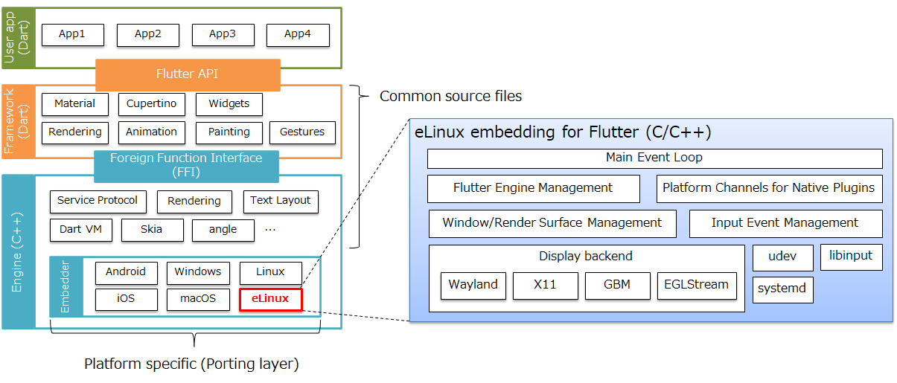

# Flutter for Embedded Linux (eLinux)


[](https://github.com/sony/flutter-elinux/actions/workflows/analysis.yml)

This software is a **non-official** extension to the [Flutter SDK](https://github.com/flutter/flutter) to build and debug Flutter apps for Embedded Linux devices using [flutter-embedded-linux](https://github.com/sony/flutter-embedded-linux), which is the flutter embedder for eLinux.

## Features
- Flutter optimized for Embedded Systems
  - Lightweight than Flutter desktop for Linux (Not using X11 and GTK)
  - arm64/x64 devices support
  - Minimal dependent libraries
- Embedded software development
  - Cross-building from x64 to arm64 support
  - Install/uninstall/debug to remote target devices
- Flutter plugins support
- Display backends
  - [Wayland](https://wayland.freedesktop.org/)
  - Direct rendering module ([DRM](https://en.wikipedia.org/wiki/Direct_Rendering_Manager))
    - Generic Buffer Management ([GBM](https://en.wikipedia.org/wiki/Mesa_(computer_graphics)))
    - [EGLStream](https://docs.nvidia.com/drive/drive_os_5.1.6.1L/nvvib_docs/index.html#page/DRIVE_OS_Linux_SDK_Development_Guide/Graphics/graphics_eglstream_user_guide.html) for NVIDIA devices
  - X11
- Keyboard, mouse and touch inputs support
- Equivalent quality to Flutter desktops
- API compatibility with Flutter desktop for Windows and GLFW
  - APIs such as MethodChannel and EventChannel are completely the same with them

If you want to know more details, see also [flutter-embedded-linux](https://github.com/sony/flutter-embedded-linux).

## Plugins
Flutter plugins for eLinux such as video_player and camera can be found at [flutter-elinux-plugins](https://github.com/sony/flutter-elinux-plugins).

## User documentation
User documentation including quick start guides can be found at [Wiki](https://github.com/sony/flutter-elinux/wiki).

## Contributing
Welcome to this project. We welcome all your contribution and feedback. See: [CONTRIBUTING.md](CONTRIBUTING.md).

## Quick start
### Install flutter-elinux
```Shell
$ git clone https://github.com/sony/flutter-elinux.git
$ sudo mv flutter-elinux /opt/
$ export PATH=$PATH:/opt/flutter-elinux/bin
```

### Install required tools
```Shell
$ sudo apt install curl clang cmake pkg-config
```

### Run Flutter sample app in Weston
You need to install a Wayland compositor such as [Weston](https://gitlab.freedesktop.org/wayland/weston/-/tree/master) and launch it before launching your Flutter apps. Note that if you use Weston, Weston version 8.0 or above recommended. See also: [Support status](https://github.com/sony/flutter-elinux/wiki/Support-status)

```Shell
$ sudo apt install weston
$ weston &
```

```Shell
$ flutter-elinux devices
2 connected devices:

eLinux (desktop) • elinux-wayland • flutter-tester • Ubuntu 20.04.2 LTS 5.8.0-63-generic
eLinux (desktop) • elinux-x11     • flutter-tester • Ubuntu 20.04.2 LTS 5.8.0-63-generic
```

```Shell
$ flutter-elinux create sample
$ cd sample
$ flutter-elinux run -d elinux-wayland
```

If you want to run your flutter app in X11, use `elinux-x11` instead of `elinux-wayland`:
```Shell
$ flutter-elinux run -d elinux-x11
```

## Companion repos
| Repo | Purpose |
| ------------- | ------------- |
| [flutter-elinux-plugins](https://github.com/sony/flutter-elinux-plugins) | Flutter plugins for eLinux |
| [flutter-embedded-linux](https://github.com/sony/flutter-embedded-linux) | eLinux embedding for Flutter |
| [meta-flutter](https://github.com/sony/meta-flutter) | Yocto recipes of eLinux embedding for Flutter |

## Base software
This software was created by branching from [flutter-tizen](https://github.com/flutter-tizen/flutter-tizen) (branched from [this version](https://github.com/flutter-tizen/flutter-tizen/commit/ed128233c0bce33c77dd0df69afa59f0888d2d00)). Special thanks to the flutter-tizen team.
